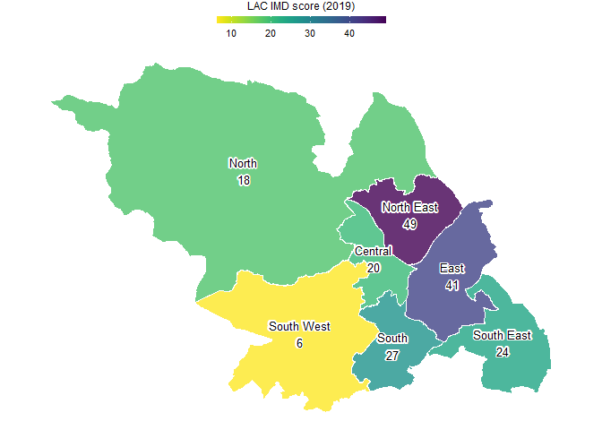

hexsheff
================

Resources to help create hexagonal cartograms for Sheffield.

## Hex maps vs choropleths

Choropleth maps are a great way to illustrate differences in a city.
However, Sheffield is part national park and population density varies
more than most cities. Often, city sub-areas are of approximately equal
population sizes, which means Sheffield sub-areas are of significantly
different geographical sizes. For Sheffield choropleths, the differences
in geographical sizes can detract attention from the main statistic of
interest.

<!-- -->

Hexagonal cartograms, or “hex maps”, are one alternative to choropleths.
They still provide an indication of location, but mute differences in
geographical size.

<!-- -->

ODI Leeds have done some interesting work on [hex
maps](https://open-innovations.org/blog/2017-05-08-mapping-election-with-hexes).

## Building a hex map template

Once a template for Sheffield sub-area hexagons is defined, e.g. by a
GeoJson file, it can be reused to illustrate different statistics. The
process for creating the LAC (Local Area Committee) hexagons was:

1.  Drop the `data/lac_asc_xref.csv` file into the ODI Leeds [hex map
    builder](https://open-innovations.org/projects/hexmaps/builder.html),
    hexify, and save hexes as HexJson.
2.  Drop the `data/lac_asc.hexjson` file into Oli Hawkins [HexJSON
    Editor](https://olihawkins.com/project/hexjson-editor/), edit, and
    download as GeoJson to file `data/lac-asc-hex.geojson`.

The [HexJSON
format](https://open-innovations.org/projects/hexmaps/hexjson.html)
defined by ODI Leeds is a great idea. However, use of the format hasn’t
been huge, so we’ve stuck with GeoJson, which plays well with the
ggplot2 R package.

[geojson.io](https://geojson.io/) is useful for viewing and editing
GeoJson files.

## Different Sheffield hex maps

So far, this repository includes a hex map for LACs:
`data/lac-asc-hex.geojson`

ASC (Adult Social Care) localities have the same boundaries as LACs. The
LAC hex map includes ASC locality cross-references, so it can be used
for that purpose too.

If hex maps prove useful, other Sheffield hex maps that could be created
include:

1.  Wards (28)  
2.  Neighbourhoods (100)

The more the audience of Sheffield hex maps use them, the easier they
will be to read. Ideally, data analysts producing the hex maps will
agree on a single hex map for each type of sub-area. New or improved
Sheffield hex maps, or suggestions, are encouraged via pull requests or
issues.
